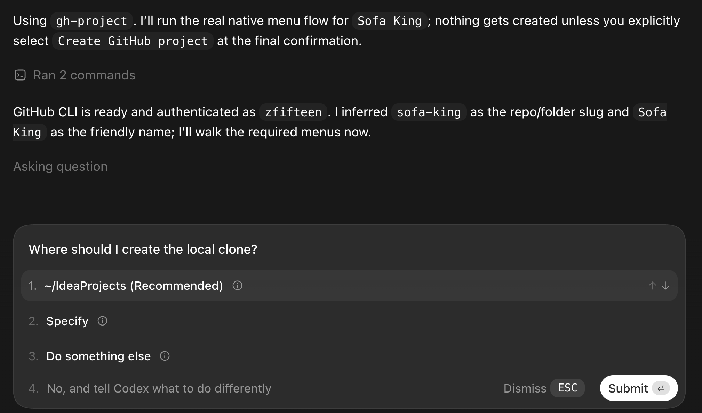
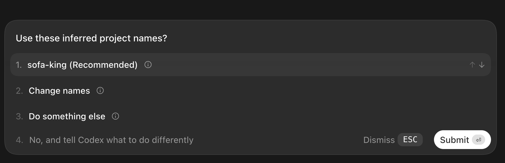
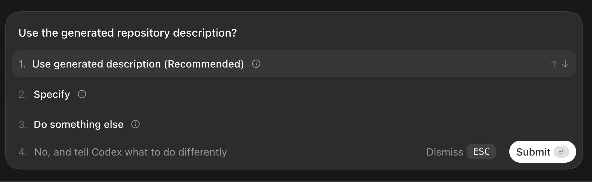

# Codex GitHub Project Wizard

Turn a project idea into a real GitHub repository without dropping out of
Codex, hunting for flags, or doing the tiny setup chores by hand.

GH Project is the Codex-native repo launcher: you describe the thing you want
to build, Codex infers a clean repository plan, and the plugin walks you through
the decisions with native menu prompts. Tap the recommended defaults, review
the final plan, confirm creation, and the repo appears on GitHub with a local
clone ready to work in.

It feels like a launch button for new ideas, with guardrails.

## The Fun Part

The normal GitHub repo setup flow has friction in all the wrong places. You
need a repo name, folder name, description, visibility, license, README,
`.gitignore`, topics, and a local clone. None of that is hard. All of it is
annoying when what you actually have is momentum.

GH Project keeps the momentum.

Ask Codex for a new GitHub project and the plugin turns the request into a
guided creation flow:

- it checks `gh` and your GitHub auth first;
- it infers a repo name, friendly name, description, topics, license, and local
  folder;
- it shows every configurable setting as a native Codex menu;
- it preselects sensible defaults instead of hiding them;
- it checks local and remote collisions before anything mutates;
- it asks for one final `Create GitHub project` confirmation;
- it creates the GitHub repo, local clone, README, license, `.gitignore`, and
  topics through one deterministic `gh` path.

The experience is fast because the defaults are good. It is trustworthy because
the final mutation still requires your explicit confirmation.

## Native Menu Workflow

The native menu flow is the whole magic trick.

Codex does not ask you to fill out a dry questionnaire. It brings up one crisp
decision at a time:

1. Parent location
2. Repo, folder, and friendly name
3. Description
4. Topics
5. Visibility
6. License
7. Initial contents
8. `.gitignore`
9. Final creation confirmation

Each menu puts the recommended choice first. You can accept the default path in
a few clicks, or stop and change the part that matters.

If the native input surface is not available, the workflow stops. It does not
fall back to numbered Markdown menus, hidden defaults, or a prose-only checklist.
The point is the Codex-native flow, not a prompt pretending to be a UI.

### What It Looks Like

The screenshots below are real captures from a `Sofa King` demo flow. The task
was stopped before final confirmation, so no repository was created.

**1. Codex starts the flow, checks `gh`, and opens the first native menu.**



**2. The generated repo and folder names appear as a recommended choice.**



**3. The generated description gets the same menu treatment.**



## Installation And Prerequisites

This plugin expects a Codex environment with plugin and skill support.

You also need:

- GitHub CLI.

The production workflow uses Codex's native menu surface.

After installing the plugin, ask Codex for something like:

```text
Use GH Project to create a new GitHub repository for my idea.
```

Codex should load the bundled `gh-project` skill, infer the repo plan, and walk
you through the native menus before creating anything.

## Safety Contract

GH Project is intentionally narrow. It creates GitHub repositories, not GitHub
Projects boards, unless you explicitly ask for a board.

The repo creation path is boring on purpose:

```bash
gh repo create REPO --public --clone --add-readme --license mit --description "DESCRIPTION"
gh repo edit OWNER/REPO --add-topic topic-a,topic-b,topic-c
```

The skill changes those flags only when you choose different settings in the
native menus. If `gh` is missing, auth is missing, the folder already exists, the
repo already exists, or the native menu surface is unavailable, it stops and
tells you the blocker.

No alternate backend. No silent fallback. No accidental repo creation.

## How The Plugin Is Built

GH Project is a plugin bundle with a skill at its center:

- `.codex-plugin/plugin.json` describes the plugin for Codex.
- `skills/gh-project/SKILL.md` is the behavior contract and source of truth.
- `spec.html` records the product contract.

The skill defines the repo creation workflow. Codex provides the production menu
UX.

## Project Docs

- [Plugin specification](spec.html)
- [Release readiness checklist](release-readiness-checklist.md)
